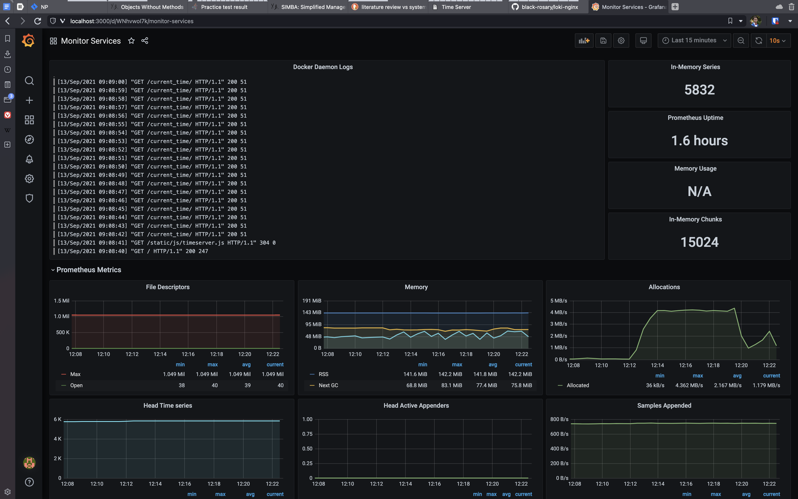

# Logging report

Screenshot of working Grafana dashboard:

## Best practices

- Use tags for logs, so we can perform filtering and other operations on logs. I used "job:docker" tag for the logs
  of docker daemon in my setup.
- Use UTC time zone for timestamps. UTC allows to have an absolute base for the time, so anybody from any point of the
  world can determine the exact time.
