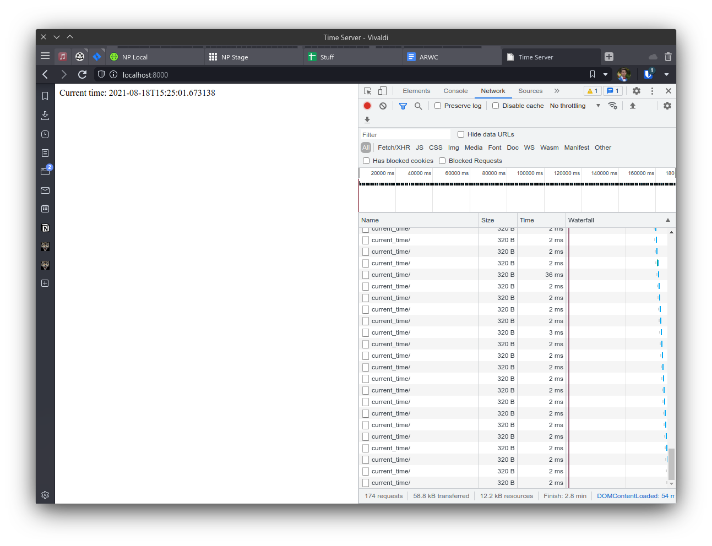

# Time Server
> DevOps Lab 1
>  
> Maxim Stepanov, BS18-SE-01

This repo contains a PoC app named "Time Server" for the first week DevOps labs.

## Usage
The simplest way to use app is to use Docker. There's `docker-compose` file in the root of repository.

Pre-built image is located at [DockerHub](https://hub.docker.com/repository/docker/iammaxim/devops).

## Repo structure
 - `app_kotlin` — contains app implemented in Kotlin language. Details are located below.
 - `app_python` — contains app implemented in Python language. Details are located below.
 - `DOCKER.md` — contains best practices for Docker used in this project.
 - `README.md` — this file.

## Kotlin app
TODO: populate

## Python app
Django 3.2 was picked as the framework for the app. It is complemented by Django Rest Framework to implement REST API endpoint for adding responsiveness to a web page.

Index page of the web server shows the main page with current time in ISO format. App also polls the backend every second to obtain new time without page reload.

