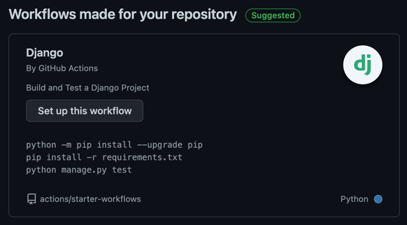

# Continuous Integration Setup for Time Server app

Since the project lives on GitHub, the inner mechanism of this provider is used — GitHub Actions.

GitHub provides the built-in template for Django, which was used as a base. It sets up the project and runs tests.



---

There are 2 jobs currently available:

- Test of the project code using Django's built-in testing framework
- Docker image build and push

Badge in the README reflects the status of last CI launch.

---

## Best practices

- Use separate jobs for separate goals. This repo contains separate jobs for testing and for building & pushing.
- Fast pipelines: the time for the entire run is kept under a minute, allowing to quickly assess the committed code.
- Automatic testing: although CI allows building project without testing, it is always good to implement self-testing to at least detect regressions.
- Automatic deployment (first step): built images are pushed to DockerHub, so (future) runner will be able to automatically check out new version and restart.
- Isolated builds: GitHub runs its CI actions in isolated containers, so the environment is reproducible and side-effect-less.

## Jenkins

Command to start up test Jenkins environment:

```docker run --rm --name jenkins -p 8080:8080 -p 50000:50000 -u 0 -v `pwd`:/var/jenkins_home -v "/var/run/docker.sock:/var/run/docker.sock" jenkinsci/blueocean```

You should also install Docker and Docker Pipeline plugins.

### Best Jenkins practices

- Don't build on master server. It is insecure, since commits/pipelines may execute malicious code. Instead, we use isolated Docker images as an environment for running pipelines.


