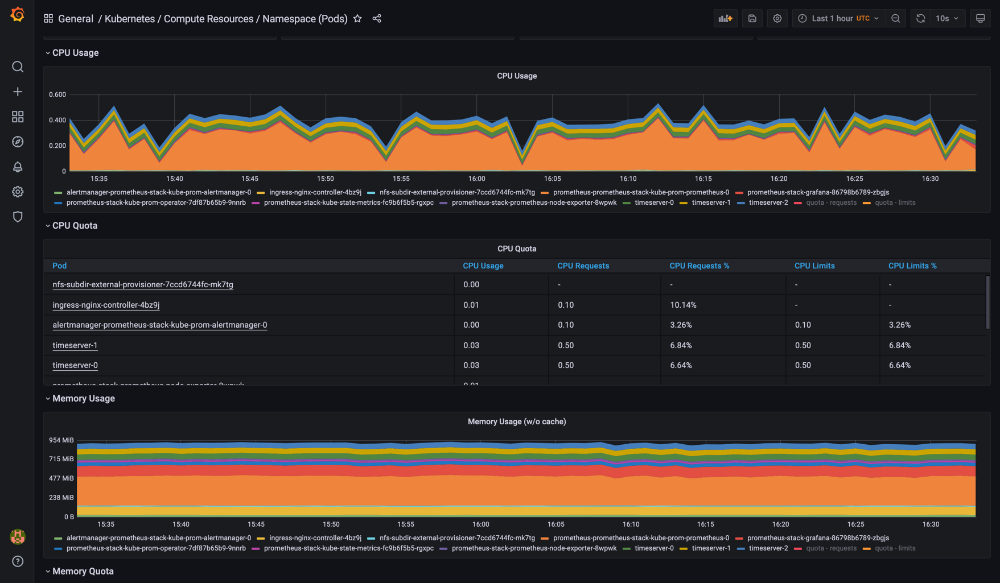
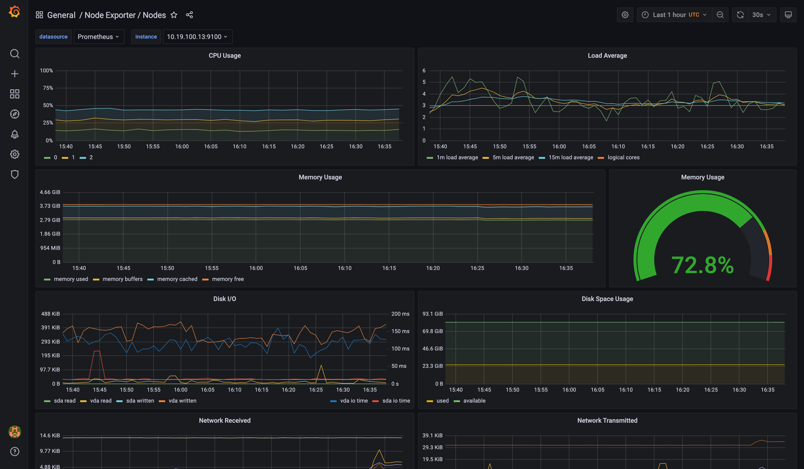
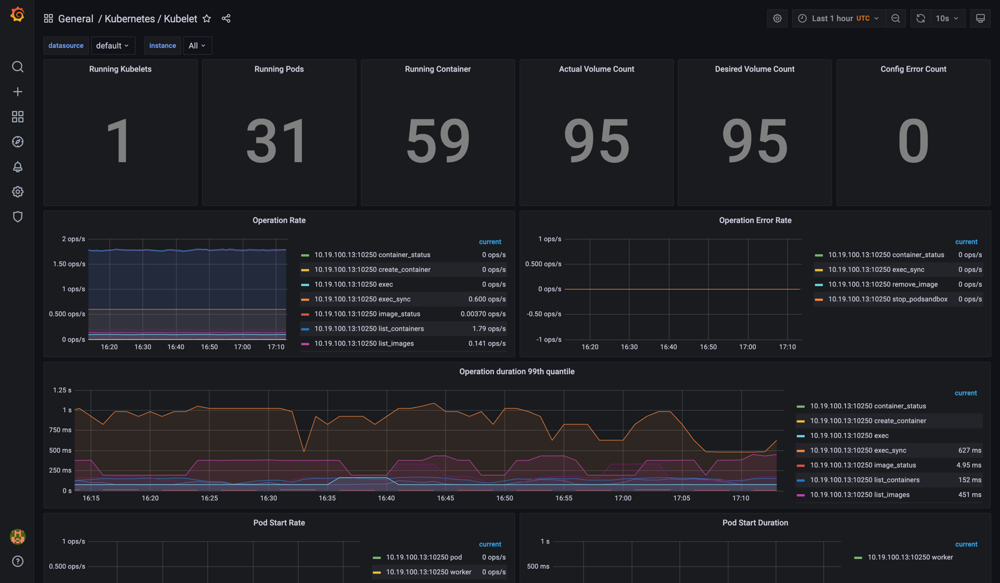
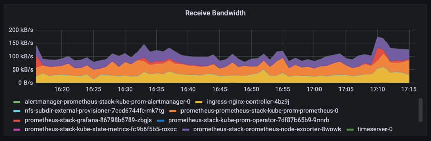
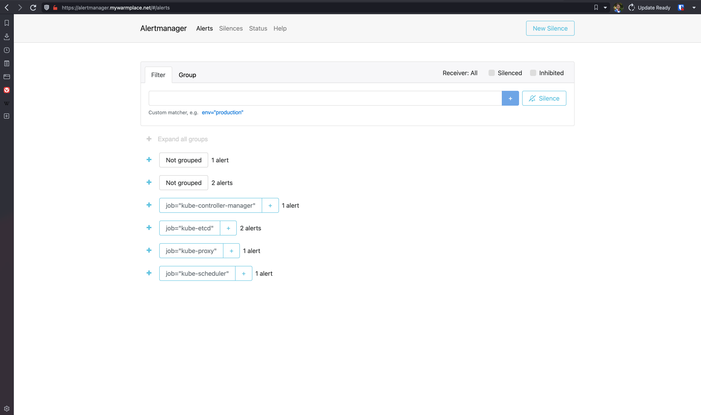

# Lab 14

## Installing Prometheus Stack

I downloaded values.yaml from the [repo](https://github.com/prometheus-community/helm-charts/tree/main/charts/kube-prometheus-stack), tweaked it a bit to enable Ingress and deployed:
```shell
helm install prometheus-stack prometheus-community/kube-prometheus-stack -f values.yaml
```

## Description of the components

Basic components are known to us from the previous labs:
- Prometheus — metrics collector. Performs HTTP requests to target services to collect the data and output it in a structured way.
- Grafana — UI that shows the collected metrics, logs, etc.
- AlertManager — middle layer between prometheus output and external services like mail, messengers or any other alert delivery system. Used to notify users of alerts immediately using instant notifications.
- Node exporter — metrics provider for hardware and OS details. Used to monitor nodes themselves.
- Kube state metrics — metrics provider for Kubernetes API server. This includes nodes, deployments, stateful sets, etc.
- Prometheus Adapter for Kubernetes Metrics APIs — one more metric provider for Kubernetes resources.

---

## The status of a cluster

This command prints all pods, stateful sets, services, persistent volume claims and config maps from the default namespace:

```shell
> kubectl get po,sts,svc,pvc,cm
NAME                                                         READY   STATUS    RESTARTS   AGE
pod/alertmanager-prometheus-stack-kube-prom-alertmanager-0   2/2     Running   0          28h
pod/ingress-nginx-controller-4bz9j                           1/1     Running   1          17d
pod/nfs-subdir-external-provisioner-7ccd6744fc-mk7tg         1/1     Running   0          2d5h
pod/prometheus-prometheus-stack-kube-prom-prometheus-0       2/2     Running   0          28h
pod/prometheus-stack-grafana-86798b6789-zbgjs                2/2     Running   0          28h
pod/prometheus-stack-kube-prom-operator-7df87b65b9-9nnrb     1/1     Running   0          28h
pod/prometheus-stack-kube-state-metrics-fc9b6f5b5-rgxpc      1/1     Running   0          28h
pod/prometheus-stack-prometheus-node-exporter-8wpwk          1/1     Running   0          28h
pod/timeserver-0                                             1/1     Running   0          2d1h
pod/timeserver-1                                             1/1     Running   0          2d1h
pod/timeserver-2                                             1/1     Running   0          2d1h

NAME                                                                    READY   AGE
statefulset.apps/alertmanager-prometheus-stack-kube-prom-alertmanager   1/1     28h
statefulset.apps/prometheus-prometheus-stack-kube-prom-prometheus       1/1     28h
statefulset.apps/timeserver                                             3/3     2d1h

NAME                                                TYPE           CLUSTER-IP       EXTERNAL-IP     PORT(S)                      AGE
service/alertmanager-operated                       ClusterIP      None             <none>          9093/TCP,9094/TCP,9094/UDP   28h
service/ingress-nginx-controller                    LoadBalancer   10.103.230.22    192.168.1.240   80:31064/TCP,443:30319/TCP   17d
service/ingress-nginx-controller-admission          ClusterIP      10.99.212.226    <none>          443/TCP                      17d
service/kubernetes                                  ClusterIP      10.96.0.1        <none>          443/TCP                      30d
service/prometheus-operated                         ClusterIP      None             <none>          9090/TCP                     28h
service/prometheus-stack-grafana                    ClusterIP      10.105.10.160    <none>          80/TCP                       28h
service/prometheus-stack-kube-prom-alertmanager     ClusterIP      10.108.123.103   <none>          9093/TCP                     28h
service/prometheus-stack-kube-prom-operator         ClusterIP      10.105.237.143   <none>          443/TCP                      28h
service/prometheus-stack-kube-prom-prometheus       ClusterIP      10.101.52.42     <none>          9090/TCP                     28h
service/prometheus-stack-kube-state-metrics         ClusterIP      10.110.146.140   <none>          8080/TCP                     28h
service/prometheus-stack-prometheus-node-exporter   ClusterIP      10.100.141.221   <none>          9100/TCP                     28h
service/timeserver                                  ClusterIP      None             <none>          8000/TCP                     2d2h

NAME                                                   STATUS   VOLUME                                     CAPACITY   ACCESS MODES   STORAGECLASS   AGE
persistentvolumeclaim/timeserver-volume-timeserver-0   Bound    pvc-6c7b61ef-4e8f-4bd6-b614-b0159a6ec169   32Mi       RWO            nfs-reliable   2d4h
persistentvolumeclaim/timeserver-volume-timeserver-1   Bound    pvc-c547c3bb-787c-4376-980a-1968655a36c3   32Mi       RWO            nfs-reliable   2d4h
persistentvolumeclaim/timeserver-volume-timeserver-2   Bound    pvc-0f52fd2c-9eaa-4cb2-bbdb-0380c49129db   32Mi       RWO            nfs-reliable   2d4h

NAME                                                                     DATA   AGE
configmap/ingress-controller-leader                                      0      17d
configmap/ingress-nginx-controller                                       0      17d
configmap/kube-root-ca.crt                                               1      30d
configmap/prometheus-prometheus-stack-kube-prom-prometheus-rulefiles-0   28     28h
configmap/prometheus-stack-grafana                                       1      28h
configmap/prometheus-stack-grafana-config-dashboards                     1      28h
configmap/prometheus-stack-grafana-test                                  1      28h
configmap/prometheus-stack-kube-prom-alertmanager-overview               1      28h
configmap/prometheus-stack-kube-prom-apiserver                           1      28h
configmap/prometheus-stack-kube-prom-cluster-total                       1      28h
configmap/prometheus-stack-kube-prom-controller-manager                  1      28h
configmap/prometheus-stack-kube-prom-etcd                                1      28h
configmap/prometheus-stack-kube-prom-grafana-datasource                  1      28h
configmap/prometheus-stack-kube-prom-k8s-coredns                         1      28h
configmap/prometheus-stack-kube-prom-k8s-resources-cluster               1      28h
configmap/prometheus-stack-kube-prom-k8s-resources-namespace             1      28h
configmap/prometheus-stack-kube-prom-k8s-resources-node                  1      28h
configmap/prometheus-stack-kube-prom-k8s-resources-pod                   1      28h
configmap/prometheus-stack-kube-prom-k8s-resources-workload              1      28h
configmap/prometheus-stack-kube-prom-k8s-resources-workloads-namespace   1      28h
configmap/prometheus-stack-kube-prom-kubelet                             1      28h
configmap/prometheus-stack-kube-prom-namespace-by-pod                    1      28h
configmap/prometheus-stack-kube-prom-namespace-by-workload               1      28h
configmap/prometheus-stack-kube-prom-node-cluster-rsrc-use               1      28h
configmap/prometheus-stack-kube-prom-node-rsrc-use                       1      28h
configmap/prometheus-stack-kube-prom-nodes                               1      28h
configmap/prometheus-stack-kube-prom-persistentvolumesusage              1      28h
configmap/prometheus-stack-kube-prom-pod-total                           1      28h
configmap/prometheus-stack-kube-prom-prometheus                          1      28h
configmap/prometheus-stack-kube-prom-proxy                               1      28h
configmap/prometheus-stack-kube-prom-scheduler                           1      28h
configmap/prometheus-stack-kube-prom-statefulset                         1      28h
configmap/prometheus-stack-kube-prom-workload-total                      1      28h
configmap/timeserver-config                                              1      2d2h
```

---

## Analyzing the Grafana dashboards

1. StatefulSet CPU/memory usage:

2. We can see that Prometheus is consuming quite a lot of CPU compared to everything else.
3. Node info:

Approximately 73% of memory is used (or 2.80GiB)
4. Kubelet stats:

I have 31 pods and 59 containers.
5. Network info:

The max usage is split between NGINX Ingress, Prometheus and Kube State Metrics (which is logical since this is a full pipeline of data for the current dashboard).
6. Alertmanager stats:

In total, I have 8 alerts.

---

## Init containers

I added init container with the same command as in the tutorial, but with my own volume, of course. Now after helm upgrade I get:
```shell
> kubectl exec timeserver-2 -- cat /volume/index.html
Defaulted container "timeserver" out of: timeserver, init-1 (init)
<html><head></head><body><header>
<title>http://info.cern.ch</title>
</header>

<h1>http://info.cern.ch - home of the first website</h1>
<p>From here you can:</p>
<ul>
<li><a href="http://info.cern.ch/hypertext/WWW/TheProject.html">Browse the first website</a></li>
<li><a href="http://line-mode.cern.ch/www/hypertext/WWW/TheProject.html">Browse the first website using the line-mode browser simulator</a></li>
<li><a href="http://home.web.cern.ch/topics/birth-web">Learn about the birth of the web</a></li>
<li><a href="http://home.web.cern.ch/about">Learn about CERN, the physics laboratory where the web was born</a></li>
</ul>
</body></html>
```
