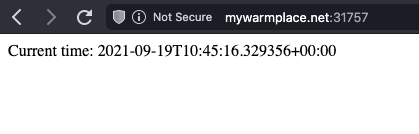

# Kubernetes

I decided (with the permission of @creed_dmitriy) to go with Kubeadm-based cluster instead of the Minikube distribution,
as I'm currently migrating my personal services to Kubernetes. Although this is a more painful process, this way I have a cluster suitable for more than just a single lab exercise.

To make sure we are on the same ground, my cluster contains:
  - A single Kubernetes node hosted on Scaleway VPS (with "master" label lifted off to allow scheduling on master node in such setup). More nodes are to be added in the future.
  - Calico as a network addon.
  - MetalLB as a load balancer to expose services to outside network.
  - Ingress NGINX as Ingress addon.
  - Cert-Manager as certificate issuer (actually, ClusterIssuer, to allow usage from all namespaces. Despite all security risks, as this is my personal cluster, I know what I deploy there) to automatically sign TLS certificates for my Ingress resources via Let's Encrypt.

I also have several personal deployments (Trilium and GitLab Runner), so they will appear later in command outputs.

Please note that MetalLB has its own pool of addresses, which are displayed in "External IP" field of command outputs. Traffic from actual network interface exposed to Internet is routed to these addresses.

---

## Manual deployment via kubectl
This is obviously a disgusting way to manage a cluster, but let's start with it:

```shell
kubectl create deployment timeserver --image=iammaxim/devops:latest
kubectl expose deployment timeserver --type=LoadBalancer --port=8000
```

The output of pod list:
```
> kubectl get pods --all-namespaces

NAMESPACE              NAME                                           READY   STATUS    RESTARTS   AGE
cert-manager           cert-manager-848f547974-blfhs                  1/1     Running   0          44h
cert-manager           cert-manager-cainjector-54f4cc6b5-qbk8s        1/1     Running   0          44h
cert-manager           cert-manager-webhook-58fb868868-c6cpw          1/1     Running   0          44h
default                ingress-nginx-controller-4bz9j                 1/1     Running   0          45h
default                timeserver-77f9c8f565-6tghm                    1/1     Running   0          96s
gitlab-runner          gitlab-runner-gitlab-runner-6cbd47dc74-6pn8l   1/1     Running   0          14d
kube-system            calico-kube-controllers-5f6cfd688c-6c2jj       1/1     Running   0          15d
kube-system            calico-node-2g7rx                              1/1     Running   0          15d
kube-system            coredns-74ff55c5b-bxwsc                        1/1     Running   0          15d
kube-system            coredns-74ff55c5b-fjb6d                        1/1     Running   0          15d
kube-system            etcd-mwp-master                                1/1     Running   0          15d
kube-system            kube-apiserver-mwp-master                      1/1     Running   0          15d
kube-system            kube-controller-manager-mwp-master             1/1     Running   0          15d
kube-system            kube-proxy-khqpl                               1/1     Running   0          15d
kube-system            kube-scheduler-mwp-master                      1/1     Running   0          15d
kube-system            metrics-server-65f8747c84-m7k69                1/1     Running   0          15d
kubernetes-dashboard   dashboard-metrics-scraper-7b59f7d4df-28tsn     1/1     Running   0          15d
kubernetes-dashboard   kubernetes-dashboard-74d688b6bc-wbkcg          1/1     Running   0          15d
metallb-system         controller-6b78bff7d9-pktnw                    1/1     Running   0          46h
metallb-system         speaker-pdnvs                                  1/1     Running   0          46h
trilium                trilium-0                                      1/1     Running   0          45h
```

The output of service list:
```
> kubectl get services --all-namespaces

NAMESPACE              NAME                                 TYPE           CLUSTER-IP       EXTERNAL-IP     PORT(S)                      AGE
cert-manager           cert-manager                         ClusterIP      10.110.145.31    <none>          9402/TCP                     44h
cert-manager           cert-manager-webhook                 ClusterIP      10.103.159.235   <none>          443/TCP                      44h
default                ingress-nginx-controller             LoadBalancer   10.103.230.22    192.168.1.240   80:31064/TCP,443:30319/TCP   45h
default                ingress-nginx-controller-admission   ClusterIP      10.99.212.226    <none>          443/TCP                      45h
default                kubernetes                           ClusterIP      10.96.0.1        <none>          443/TCP                      15d
default                timeserver                           LoadBalancer   10.111.182.29    192.168.1.241   8000:31757/TCP               8s
kube-system            kube-dns                             ClusterIP      10.96.0.10       <none>          53/UDP,53/TCP,9153/TCP       15d
kube-system            metrics-server                       ClusterIP      10.96.160.192    <none>          443/TCP                      15d
kubernetes-dashboard   dashboard-metrics-scraper            ClusterIP      10.109.112.168   <none>          8000/TCP                     15d
kubernetes-dashboard   kubernetes-dashboard                 ClusterIP      10.98.73.0       <none>          443/TCP                      15d
trilium                trilium                              ClusterIP      10.111.73.236    <none>          80/TCP                       45h
trilium                trilium-headless                     ClusterIP      None             <none>          80/TCP                       45h
```

And the screenshot of working website:



Cleanup:

```shell
kubectl delete service timeserver
kubectl delete deployment timeserver
```

---

## The right way to deploy

Of course, the right way is through YAML-engineering (declarative description of deployment).

I created `deployment.yml` and `service.yml` and applied them with `kubectl apply -f <file.yml>`.

As a result, I have 3 replica pods. 

Output of commands:
```
> kubectl get pods --all-namespaces 
   
NAMESPACE              NAME                                           READY   STATUS    RESTARTS   AGE
cert-manager           cert-manager-848f547974-blfhs                  1/1     Running   0          45h
cert-manager           cert-manager-cainjector-54f4cc6b5-qbk8s        1/1     Running   0          45h
cert-manager           cert-manager-webhook-58fb868868-c6cpw          1/1     Running   0          45h
default                ingress-nginx-controller-4bz9j                 1/1     Running   0          46h
default                timeserver-7c58f484fc-429qn                    1/1     Running   0          22m
default                timeserver-7c58f484fc-gch7s                    1/1     Running   0          22m
default                timeserver-7c58f484fc-qgk25                    1/1     Running   0          22m
gitlab-runner          gitlab-runner-gitlab-runner-6cbd47dc74-6pn8l   1/1     Running   0          14d
kube-system            calico-kube-controllers-5f6cfd688c-6c2jj       1/1     Running   0          15d
kube-system            calico-node-2g7rx                              1/1     Running   0          15d
kube-system            coredns-74ff55c5b-bxwsc                        1/1     Running   0          15d
kube-system            coredns-74ff55c5b-fjb6d                        1/1     Running   0          15d
kube-system            etcd-mwp-master                                1/1     Running   0          15d
kube-system            kube-apiserver-mwp-master                      1/1     Running   0          15d
kube-system            kube-controller-manager-mwp-master             1/1     Running   0          15d
kube-system            kube-proxy-khqpl                               1/1     Running   0          15d
kube-system            kube-scheduler-mwp-master                      1/1     Running   0          15d
kube-system            metrics-server-65f8747c84-m7k69                1/1     Running   0          15d
kubernetes-dashboard   dashboard-metrics-scraper-7b59f7d4df-28tsn     1/1     Running   0          15d
kubernetes-dashboard   kubernetes-dashboard-74d688b6bc-wbkcg          1/1     Running   0          15d
metallb-system         controller-6b78bff7d9-pktnw                    1/1     Running   0          46h
metallb-system         speaker-pdnvs                                  1/1     Running   0          46h
trilium                trilium-0                                      1/1     Running   0          46h
```

```
> kubectl get services --all-namespaces

NAMESPACE              NAME                                 TYPE           CLUSTER-IP       EXTERNAL-IP     PORT(S)                      AGE
cert-manager           cert-manager                         ClusterIP      10.110.145.31    <none>          9402/TCP                     44h
cert-manager           cert-manager-webhook                 ClusterIP      10.103.159.235   <none>          443/TCP                      44h
default                ingress-nginx-controller             LoadBalancer   10.103.230.22    192.168.1.240   80:31064/TCP,443:30319/TCP   46h
default                ingress-nginx-controller-admission   ClusterIP      10.99.212.226    <none>          443/TCP                      46h
default                kubernetes                           ClusterIP      10.96.0.1        <none>          443/TCP                      15d
default                timeserver                           LoadBalancer   10.108.24.146    192.168.1.241   80:31852/TCP                 12s
kube-system            kube-dns                             ClusterIP      10.96.0.10       <none>          53/UDP,53/TCP,9153/TCP       15d
kube-system            metrics-server                       ClusterIP      10.96.160.192    <none>          443/TCP                      15d
kubernetes-dashboard   dashboard-metrics-scraper            ClusterIP      10.109.112.168   <none>          8000/TCP                     15d
kubernetes-dashboard   kubernetes-dashboard                 ClusterIP      10.98.73.0       <none>          443/TCP                      15d
trilium                trilium                              ClusterIP      10.111.73.236    <none>          80/TCP                       45h
trilium                trilium-headless                     ClusterIP      None             <none>          80/TCP                       45h
```

## Bonus tasks
The time has come for my first bonus task!

---

Ingress is a kind of router/load balancer that allows traffic from the edge node to be distributed to pods in the entire cluster (even on other nodes, which are not exposed to the internet directly). This is available thanks to the network layer which connects the entire cluster. It has features similar to NGINX: selecting target pod based on hostname, URL regexes, etc. Ingress itself is useless, it is just a resource. It should be used in conjunction with Ingress Controller.

---

Ingress Controller. In order to use Ingress, the traffic should be handled by an Ingress Controller, which decides which Ingress resource should be used for a particular connection. This is the controller that actually performs the logic.

In my cluster, Ingress NGINX controller is used, which is officially supported by the Kubernetes project.

---

StatefulSet. Initially, Kubernetes was intended to only run stateless apps (usually microservices). It later became clear, though, that stateful apps may be supported as well, so separate resource type was added — StatefulSet. It allows associating pods with their dedicated state, mostly PersistentVolumes. In StatefulSet, during pod creation, the stateful claims are uniquely associated with that specific pod, and even in case the pod is rescheduled to another node, this state is transferred with it.

Actually, in my cluster, I have Trilium notes deployed, which stores its data in a volume. It has a StatefulSet with one pod and PersistentVolume along with PersistentVolumeClaim.

---

DaemonSet — kind of deployment where each node has exactly one running pod of this set. An example — coredns, Kubernetes' internal DNS resolver, which should be present on each node, but exactly once. Or Calico, which interconnects nodes with a network layer.

---

PersistentVolume — basically, a Docker volume that is associated with specific pod. It may have different access modes — for example, only one pod may use it at a time, or several pods may use it simultaneously. Once a persistent volume is claimed by pod with PersistentVolumeClaim, most of the options become unchangeable. This, only volume deletion and recreation allows to modify its options.

