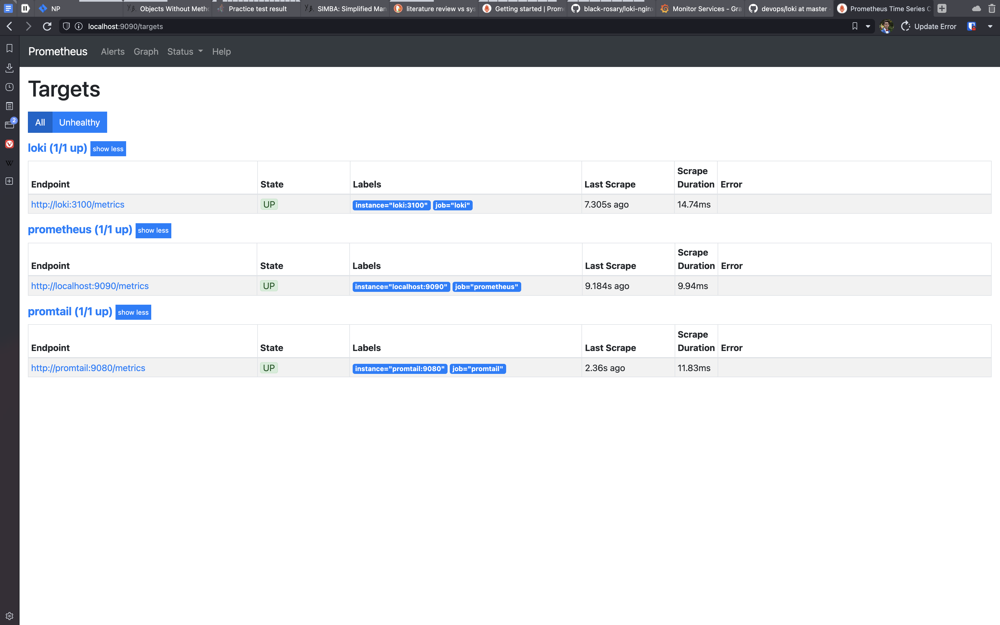
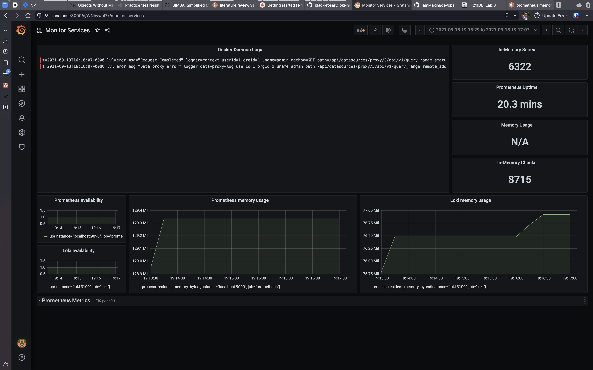

# Logging report

## Grafana, Loki and Promtail

As a base, I used the repository provided in the lab assignment: https://github.com/black-rosary/loki-nginx. This repo contains example of monitoring NGINX instance, with custom endpoint tester written in Go. Since my project does not have any proxy (for now), I dropped the part of monitoring NGINX and only monitor Docker daemon.

I spent *some* (couple of hours) time trying to understand what each config contains and how different services interact, and changed configs in accordance to my docker-compose file (container names, etc.).

After everything booted up, I decided to comment out the existing config and start from scratch. One GitHub issue provided me with a working snippet of scraping config, I plugged it into `promtail.yml` and moved forward to Grafana.
There, I added a new **Logs** panel and set up query to pull logs tagged by my tag.

After that, I moved panels around to look prettier, saved the dashboard and exported it as a JSON, then inserted it into the config to automatically setup during Docker deploy.

Screenshot of working Grafana dashboard:

### Best practices

- Use tags for logs, so we can perform filtering and other operations on logs. I used "job:docker" tag for the logs
  of docker daemon in my setup.
- Use UTC time zone for timestamps. UTC allows to have an absolute base for the time, so anybody from any point of the
  world can determine the exact time.

## Prometheus

Setting up Prometheus was easy after the other part of stack is ready. Config is almost identical copy of Promtail's one.

I added Grafana panels for Loki and Prometheus up/down status and their memory usage.

Screenshot of working Prometheus:

Screenshot of dashboard with Prometheus metrics:

### Best practices
- Use appropriate visualizer. For both availability and memory usage it is logical to use plots to see the change over time.
- Understand exported metrics. To truly use the potential of metrics, you need to understand which of them are required for a particular goal. In my case, I don't have a specific goal, so I just plotted availability and memory usage.

